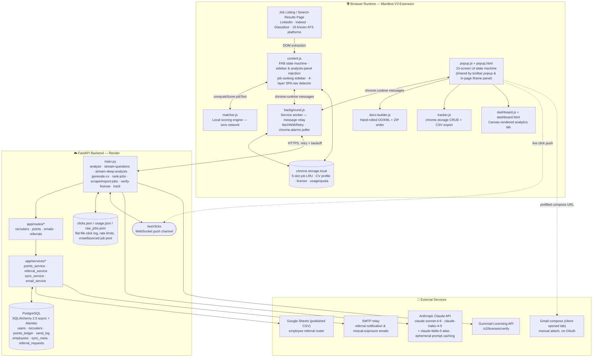
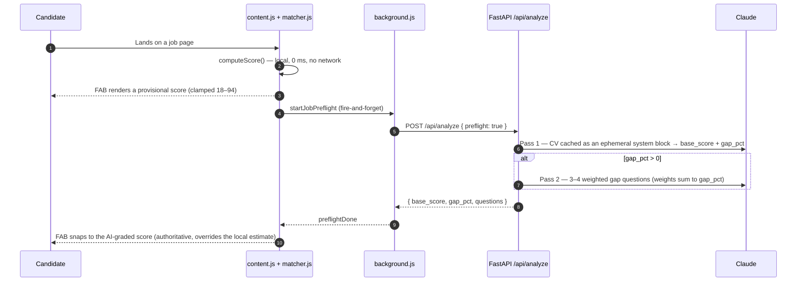
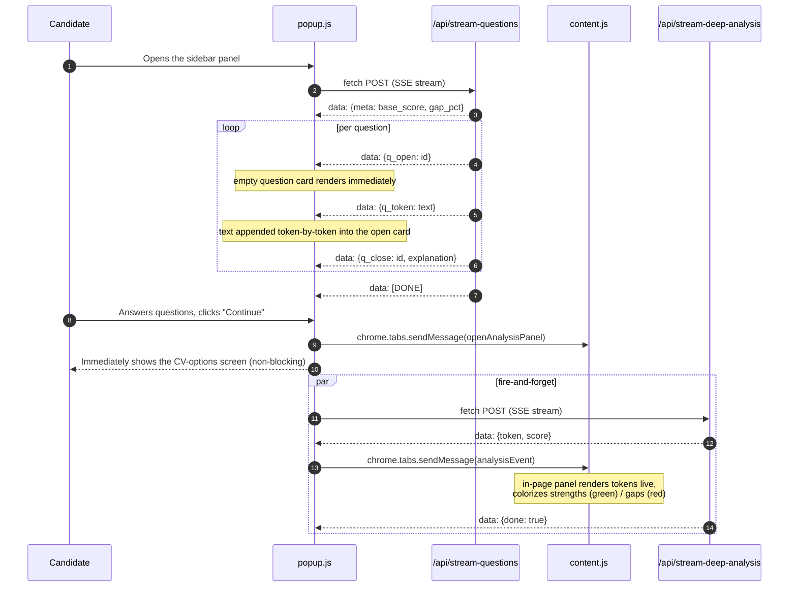
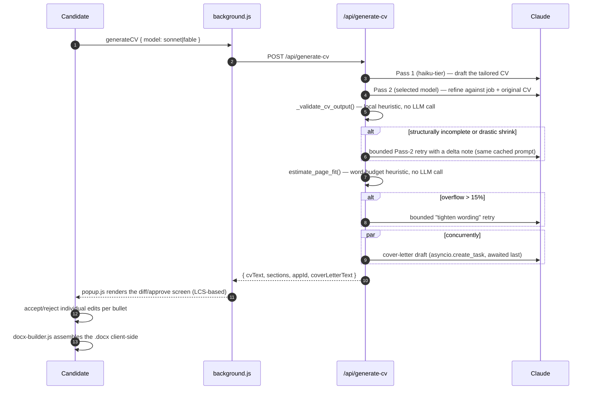
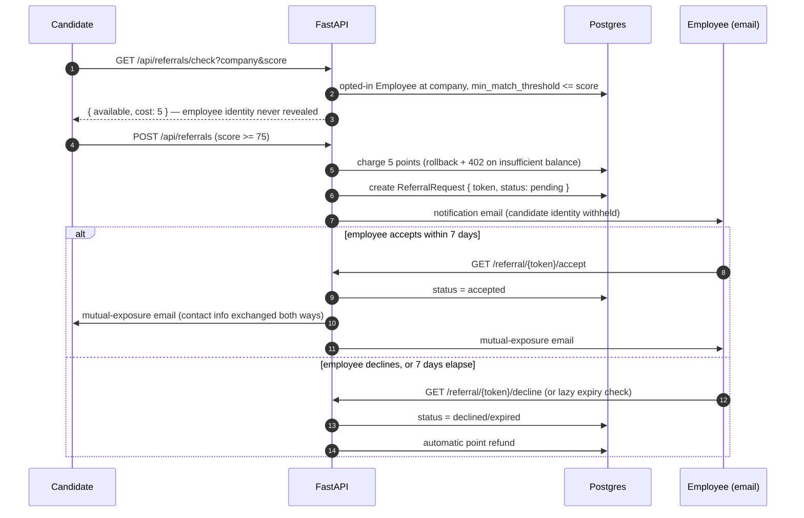

<p align="center">
  
</p>

<h1 align="center">Job Match AI</h1>

<p align="center">
  <strong>An in-browser inference engine that closes the signal gap between candidate and job description —<br/>
  real-time fit scoring, LLM-orchestrated CV tailoring, community recruiting, employee referrals, and closed-loop
  engagement analytics, entirely inside a Manifest V3 extension.</strong>
</p>

<p align="center">
  
  
  
  
  
  
</p>

<p align="center">
  
</p>

<!-- TODO(visual — hero GIF):
     Capture: a ~5s screen recording of the full golden path on a real job posting (LinkedIn or Indeed).
     Sequence to perform on camera: (1) land on a job page and let the floating action button (FAB)
     fill from its local provisional score to the AI-graded score, (2) click the FAB to open the
     sidebar panel, (3) answer one competency question by clicking a 0/40/100% button and watch the
     live score bar move, (4) click "Generate CV" and show the diff/approve screen appearing.
     Save the file to: assets/hero-demo.gif  (create the assets/ directory at the repo root if it
     does not exist yet). Recommended: <8MB, 800px wide, captured with ScreenToGif/Kap/Peek at 12-15fps.
     No path update needed if you keep the exact filename above. -->

---

## Table of Contents

- [Why This Exists](#why-this-exists)
- [Complete Feature Inventory](#complete-feature-inventory)
- [System Architecture](#system-architecture)
- [Request Lifecycles](#request-lifecycles)
- [Engineering Deep Dives](#engineering-deep-dives)
  - [A. Local Intelligence Layer](#a-local-intelligence-layer--matcherjs)
  - [B. Job Discovery, Ranking & Crowdsourcing](#b-job-discovery-ranking--crowdsourcing)
  - [C. Streaming AI UX](#c-streaming-ai-ux)
  - [D. CV Generation Pipeline](#d-cv-generation-pipeline)
  - [E. Document Engine](#e-document-engine)
  - [F. Recruiter Engagement Analytics](#f-recruiter-engagement-analytics)
  - [G. Community Recruiting & the Points Economy](#g-community-recruiting--the-points-economy)
  - [H. Employee Referral System](#h-employee-referral-system)
  - [I. Licensing & Access Control](#i-licensing--access-control)
  - [J. Resilience Engineering](#j-resilience-engineering)
- [Feature Tour](#feature-tour)
- [Tech Stack](#tech-stack)
- [Repository Structure](#repository-structure)
- [Getting Started](#getting-started)
- [Engineering Notes & Honest Tradeoffs](#engineering-notes--honest-tradeoffs)
- [License](#license)

---

## Why This Exists

Most job applications fail on a signal problem, not a talent problem: a qualified candidate submits a generic CV to a role they're 80% qualified for, and loses to someone who happened to mirror the posting's exact language. **Job Match AI** closes that gap from inside the browser — it reads the live job description on the page the candidate is already looking at, scores it against their CV, walks them through a short structured competency check, and produces a tailored, ATS-shaped document before they ever open a text editor. Around that core loop, the product has grown a full community layer: a points-based recruiter directory, a privacy-preserving employee-referral system, and closed-loop analytics that tell a candidate when a recruiter actually opened their links.

The system is built around three constraints that shape almost every design decision documented below:

1. **Perceived-zero latency** — a provisional match score renders synchronously, from a local rules engine, before any network request is even sent.
2. **LLM cost discipline** — a multi-tier model strategy, aggressive prompt caching, and local-first heuristics (validation, page-fit, diffing) keep token spend far below a naïve single-call design.
3. **Graceful degradation on a free-tier host** — the backend cold-starts on Render's free plan and has no cron scheduler; the client assumes every request might time out or sleep, and background jobs (Google Sheet sync, referral expiry) run lazily on request instead of on a schedule.

---

## Complete Feature Inventory

Every row below is implemented and traced to concrete code in this repository (file/function/endpoint), reconstructed from the full commit history and a systematic scan of every route, message action, and database table. Rows marked **dormant** are real, working code paths that exist in the repo but are not currently reachable from the live UI — called out explicitly rather than silently omitted.

| # | Feature | Where it lives |
|---|---|---|
| 1 | Zero-network local match scoring | `matcher.js` → `window.JMA_Matcher.computeScore()` |
| 2 | Two-stage preflight analysis (local → AI-graded) | `content.js` `runFabPipeline`/`initJobFab`, `background.js` `startJobPreflight`, `POST /api/analyze` |
| 3 | CV profile extraction (structured skills JSON) | `popup.js` `_extractAndSaveProfile`, `POST /api/extract-profile` |
| 4 | Streaming competency questions (token-by-token) | `popup.js` `streamQuestionsIntoScreen`, `POST /api/stream-questions` |
| 5 | Parallel deep-analysis overlay (in-page streaming panel) | `popup.js` `startDeepAnalysisOverlay`, `content.js` `_openAnalysisPanel`/`_handleAnalysisEvent`, `POST /api/stream-deep-analysis` |
| 6 | *(dormant)* Legacy question-by-question streaming screen | `popup.js` `runStreamingAnalysis`, `POST /api/analyze-stream` |
| 7 | Job-ranking sidebar for listing/search pages | `content.js` `initSidebar`/`startRanking`, `POST /api/rank-jobs` |
| 8 | Zero-AI-cost job-detail fetch for ranking | `background.js` `fetchJobDetails` handler (DOM extraction via `DOMParser`) |
| 9 | Crowdsourced anonymous job scraping | `content.js` (`shareJobsConsent` gate), `background.js` `scrapeJob`, `POST /api/scrape-job` |
| 10 | Community job import ("Premium" screen) | `popup.js` `showPremiumScreen`, `background.js` `importPremiumJobs`, `POST /api/import-jobs` |
| 11 | Four-layer SPA navigation detection | `content.js` `popstate` + patched `pushState`/`replaceState` + `MutationObserver` + 1.5s poll |
| 12 | LinkedIn-specific navigation-stamp watcher | `background.js` `chrome.tabs.onUpdated` listener + `_navKey` |
| 13 | Two-pass CV generation with validation retries | `POST /api/generate-cv`, `_validate_cv_output`, `estimate_page_fit` |
| 14 | Model selector with per-tier monthly quotas | `popup.js` `showCVOptionsScreen` (`cvOptions.model`), `QUOTA_LIMITS`, `_resolve_model` |
| 15 | Concurrent cover-letter generation | `main.py` `asyncio.create_task` inside `/api/generate-cv` |
| 16 | Hand-rolled OOXML + ZIP DOCX engine | `docx-builder.js` (CRC32 table, manual ZIP writer) |
| 17 | Adaptive page-fit layout system (shared DOCX/PDF) | `docx-builder.js` `LAYOUT_PROFILES`/`pickFittingProfile`, `popup.js` `buildCvPrintHtml` |
| 18 | LCS line + word diff/approve editor | `popup.js` `lcsOps`, `wordDiffHtml`, `renderDiffScreen`, `applyDiffChoices` |
| 19 | Personal CV constraints (rules injected into the prompt) | `popup.js` `CONSTRAINT_MAP`, Settings screen checkboxes |
| 20 | Opt-in recruiter-link tracking injection | `popup.js` `#cbTracking`/`enableTracking`, tracked link rewrite before docx build |
| 21 | Community recruiter directory (add / search) | `app/routes/recruiters.py`, `recruiters` table |
| 22 | Points ledger (derived balance, append-only) | `app/services/points_service.py`, `points_ledger` table |
| 23 | Recruiter outreach via Gmail compose (draft + billed open) | `app/routes/emails.py`, `POST /api/recruiter-letter`, `POST /api/emails/log-open` |
| 24 | Admin bulk recruiter import from `.xlsx` | `POST /api/admin/recruiters/import`, `require_admin` |
| 25 | Employee referral eligibility check (privacy-preserving) | `GET /api/referrals/check`, `referral_service.py` |
| 26 | Employee referral request + token accept/decline pages | `POST /api/referrals`, `GET /referral/{token}/accept|decline` |
| 27 | Google Sheet → `employees` table lazy sync | `app/services/sync_service.py`, `sync_meta` table |
| 28 | Referral auto-expiry with automatic refund | `referral_service.expire_stale_referrals` |
| 29 | Gumroad license verification with stale-cache fallback | `main.py` `verify_gumroad_license` |
| 30 | Monthly usage limiting | `main.py` `require_license`, `usage.json` |
| 31 | Admin key authorization (reuses license header) | `app/core/deps.py` `require_admin` |
| 32 | Recruiter link-click tracking + 302 redirect | `GET /api/v1/track`, `clicks.json` |
| 33 | Real-time click push (WebSocket) | `WS /ws/clicks` |
| 34 | Public employee self-registration for the referral pool | `GET /join-referrers`, `POST /api/public/employees/register` |
| 34 | Click polling fallback + system notification + badge | `background.js` `chrome.alarms` poller (`_pollClicks`) |
| 35 | In-popup tracker screen + CSV export | `tracker.js`, `popup.js` `showTrackerScreen` |
| 36 | Full-tab analytics dashboard (Canvas charts) | `dashboard.js`, `dashboard.html` |
| 37 | *(stub)* Market benchmarking endpoint | `GET /api/analytics/market-compare` |
| 38 | Cold-start-aware retry/backoff | `background.js` `fetchWithRetry` |
| 39 | Custom raw ASGI CORS middleware | `main.py` `_CORSMiddleware` |
| 40 | Mixed persistence architecture | Postgres (`app/core/db.py`) vs. flat JSON (`clicks.json`/`usage.json`) vs. `chrome.storage.local` |
| 41 | Automated test suite | `server-python/tests/*` (pytest, 7 files) |
| 42 | *(superseded)* Legacy Node/Express proxy | `server/server.js` |
| 43 | 13-screen popup UI state machine with resume-on-reopen | `popup.js` `showScreen`, `routeToCorrectScreen`, `wizard_step` |
| 44 | Debounced per-job save-flow with 5-slot LRU + 4h TTL | `content.js`/`popup.js` `saveJobState`/`loadJobState`, `jma_recent_jobs` |
| 45 | FAB hover-to-reveal reason bullets | `content.js` `_showFabReasons`, `mouseenter`/`mouseleave` handlers |

---

## System Architecture



Three design choices stand out as deliberate, not incidental:

- **Everything upstream of the network boundary is optimistic.** `matcher.js` computes a real (if approximate) score with zero HTTP calls, so the UI never shows a blank loading state on a page the user is already reading.
- **The extension talks to itself through `chrome.runtime` messaging, not `window.postMessage`.** The in-page sidebar is literally `popup.html` rendered inside an injected `<iframe>`, and both it and the in-page deep-analysis panel reach `background.js`/`content.js` exclusively via the extension's own signed message bus — never a cross-frame `postMessage` reachable by the host page's own scripts.
- **No feature requires a scheduler.** The backend has no cron job anywhere. Recurring work — the employees-sheet sync, referral expiry, click polling — is triggered lazily on the next relevant request or by a `chrome.alarms` tick, which is the correct adaptation to a free-tier host with no background worker.

---

## Request Lifecycles

### 1. Two-stage scoring: local estimate → AI-graded score



### 2. Streaming competency questions + parallel deep-analysis overlay



### 3. CV generation, validation, and the diff/approve loop



### 4. Employee referral lifecycle



---

## Engineering Deep Dives

### A. Local Intelligence Layer — `matcher.js`

Before any HTTP request is sent, `window.JMA_Matcher.computeScore(profile, jobText)` runs entirely client-side and returns a score in ~0 ms. It is a genuine rules-based scoring engine, not a keyword count:

- A tri-state line-based parser (`_parseJobSections`) classifies each line of the posting as *context*, *required*, or *advantage* by detecting bilingual (Hebrew/English) section headers, falling back to "everything is required" for headerless postings.
- Requirement extraction is bullet-scoped — a "3+ years Python" clause is only attributed to technologies mentioned on the *same line*, preventing an experience number from leaking onto an unrelated adjacent bullet. Hebrew number words (e.g. "שנתיים" → 2 years) and OR-groups ("one of the following: X, Y, Z") are handled explicitly, scored by best match in the group rather than penalized for missing the rest.
- **Bidirectional alias matching via `search_tags`**: a job requiring "SQL" can resolve against a CV profile entry literally named "PostgreSQL" if "SQL" is listed among that entry's server-extracted `search_tags` — matching runs both forward (profile term found in job text) and in reverse (job term found among a profile entry's aliases), so the local engine benefits directly from the richer structured profile produced by `/api/extract-profile` rather than working off raw keyword lists alone.
- Hebrew and Latin substrings are matched with different strategies in the same function: Latin terms use a word-boundary regex (cached per-term to avoid recompilation), while Hebrew terms match as substrings with attached-preposition variants (ב/כ/ל/מ/ו/ה/ש), because Hebrew prepositions concatenate directly onto the following word.
- Scoring is a weighted point pool: required skills carry full weight (`REQUIRED_MULT = 1.0`), "advantage" skills carry 40% (`ADVANTAGE_MULT = 0.40`). Experience for a given skill is a **blended model**: `effective_years = industry_years + personal_years × (personal_weight / 100)` — a side project doesn't count as much as a paid role unless the candidate explicitly weights it higher, and legacy profiles without a `personal_weight` default to 50%.
- The output score is deliberately clamped to **[18, 94]** — it never claims certainty at either extreme — and it is explicitly superseded the moment the backend's AI-graded score arrives (`saveJobState({baseScore: evt.score})` on every streamed update).

### B. Job Discovery, Ranking & Crowdsourcing

Beyond scoring a single job the candidate is already viewing, the extension has a separate subsystem for **listing/search-results pages** with multiple job cards:

- **`initSidebar()`** activates on a delay (1.8s, after the FAB's own 2.2s init) to let SPA-rendered card lists finish painting. Card detection is three-tier: an explicit per-domain selector map (`CARD_CONFIGS`, covering LinkedIn/Indeed/Glassdoor/NVIDIA careers/Greenhouse/Lever/JobMaster/AllJobs/Drushim), a generic structural fallback (`GENERIC_CARD_SELECTORS`), and a last-resort DOM-clustering heuristic (`findRepeatedLinkContainers`) that groups same-tag/class elements with enough text and a link — gated behind the same bilingual job-keyword signal used by the single-job FAB, so it never fires on non-job pages.
- Ranking (`startRanking()`) first checks a **20-minute local cache** keyed by page URL; on a miss, it asks `background.js`'s `fetchJobDetails` handler to fetch each card's full posting text server-side-free (raw HTML fetch + `DOMParser` extraction, zero AI cost), then sends the enriched job list to `POST /api/rank-jobs`, which returns a per-job `{score, pro, con}` via a single Claude call (max 12 jobs per request). Results render as a sorted, color-coded list in a slide-in `#jma-sidebar` panel.
- **Crowdsourced job data**: with the user's opt-in consent (`shareJobsConsent`, set in Settings), every verified job page they visit is silently POSTed to `/api/scrape-job` — no auth, no AI, just URL-deduplication into a flat `raw_jobs.json` pool (capped at 10,000 entries). In exchange, the same opt-in unlocks the "Premium" screen's community job import: `/api/import-jobs` runs a 2-stage filter over that pool (keyword pre-filter, then concurrent Claude scoring with `asyncio.Semaphore(5)` bounding parallelism) against the requesting candidate's own CV, filtered by a minimum score and a time range (last 3 days, or since their last import), and returns a real `.xlsx` file via `pandas`+`openpyxl`. This is a genuine reciprocal data-sharing model, not a paywall — the gate is a consent checkbox, not a license tier.
- **SPA navigation is detected four independent ways** in `content.js` — a `popstate` listener, monkey-patched `history.pushState`/`replaceState`, a `MutationObserver` on `<title>`, and a 1.5s polling safety net acknowledged in-code as necessary because MV3's isolated content-script world cannot always observe navigations triggered by a page's own router. `background.js` additionally runs a narrower, LinkedIn-specific watcher on `chrome.tabs.onUpdated` that stamps a navigation timestamp so the popup can detect a URL change even if it was closed during the transition.

### C. Streaming AI UX

Two live SSE streams are actually wired into the UI, both consumed by hand-rolled `fetch(...).body.getReader()` parsing (no `EventSource`):

- **`streamQuestionsIntoScreen()`** consumes `POST /api/stream-questions`. The backend emits a `meta` event first (Pass-1 base score/gap, skipped entirely if the client already supplied a local matcher score — a direct cost saving from the local-first design), then streams each question as `q_open` (an empty card renders immediately) → repeated `q_token` (text appended live, so the user can start reading and even start typing before the question finishes generating) → `q_close` (adds the explanation line once complete).
- **`startDeepAnalysisOverlay()`** is fired-and-forgotten the instant the user continues past the questions screen — the popup immediately shows the CV-options screen while, in parallel, it opens a companion panel *inside the job page itself* (`chrome.tabs.sendMessage({action:'openAnalysisPanel'})`) and streams `POST /api/stream-deep-analysis` tokens into it via `analysisEvent` messages. The backend's response format is a single `[SCORE]NN[/SCORE]` tag followed by a flowing Hebrew analysis; the streaming parser buffers only until that tag closes, extracts the score, and streams every token after it live. `content.js` renders the tokens into a raw text node and, once `done` arrives, re-colorizes completed lines by keyword-sniffing strength ("חוזק"/"יתרון") vs. gap ("חסר"/"פער") language.
- **A third, fully-implemented streaming consumer (`runStreamingAnalysis`) exists but is never called** — it targets a different endpoint (`/api/analyze-stream`) on what appears to be an earlier backend hostname, and renders into a UI pattern (`.stream-wrap` inside the main screen) that was superseded by the two-panel split above. It's real, working code, just not reachable from any current button or flow — documented here rather than silently presented as live.

### D. CV Generation Pipeline

- **Two Claude passes per CV**: a cheap haiku-tier draft, then a refine/validate pass on the user's *selected* model — a genuine three-way model choice exposed in the UI (see below), not just an internal implementation detail.
- **Model selector with real quota enforcement**: the CV-options screen injects a Sonnet/Fable toggle (`cvOptions.model`), each showing a live `used/limit` badge sourced from `chrome.storage.local['jma_usage']`, which resets automatically when the stored month string rolls over. Standard-tier limits are `{sonnet: 30, fable: 5}`/month, premium-tier `{sonnet: ∞, fable: 20}`/month; the Fable button self-disables once its monthly quota is exhausted. `_resolve_model()` on the backend maps the `"fable"` alias to the literal model ID `claude-fable-5` — presented here as-is since that is what the code requests, without independently vouching for it as a publicly documented Anthropic model ID.
- **Local, LLM-free validation loops** gate every retry: `_validate_cv_output()` checks required section markers are populated, experience bullets exist, and the output isn't a drastic character-count shrink versus the original — triggering at most one bounded Pass-2 retry with a short delta note (reusing the identical cached prompt so the retry still hits cache). `estimate_page_fit()` is a pure word-budget heuristic (620 words EN / 550 HE, +2 virtual words per role header) that triggers at most one "tighten wording" retry if projected overflow exceeds 15%. Neither loop burns an extra full-price LLM call on every generation — only on the (validated) cases that actually need it.
- **Cover-letter generation runs concurrently**, not sequentially: `asyncio.create_task` starts it alongside the CV passes and it's only awaited at the very end, so its latency is hidden behind the CV-refinement pass rather than added on top of it.
- **Personal CV constraints**: four checkboxes in Settings (no job-title changes, summary-only edits, no history deletion, bold key technologies) are two-way bound to canned sentences in a free-text rules textarea via `CONSTRAINT_MAP` — checking a box appends its sentence, unchecking removes the matching line — and the resulting free text is sent to the generation prompt as binding constraints the model must follow.
- **Opt-in tracking-link injection**: a Settings/CV-options checkbox (`enableTracking`, defaulting on) controls whether outbound CV hyperlinks (GitHub/LinkedIn/portfolio) get rewritten through the tracking redirect before the document is built — with an explicit UI warning that tracked links can trigger a Word security prompt for the recipient, a real tradeoff surfaced honestly to the user rather than hidden.

### E. Document Engine

The `.docx` file is **not** generated on the server — it is assembled entirely client-side, byte-for-byte, with no library (no `docx.js`, no JSZip):

- WordprocessingML XML (`<w:p>`, `<w:r>`, `<w:rPr>`, hyperlink relationships) is built by direct string/array construction.
- A CRC32 lookup table is generated at load time and used to checksum every entry of a manually-written ZIP container — local file headers, central directory records, and the End-Of-Central-Directory record are all written as raw `Uint8Array` byte sequences.
- An **adaptive page-fit system** (`LAYOUT_PROFILES`: normal → tight → compact) estimates line overflow with a pure, DOM-free glyph-width heuristic — deliberately written so it can also run under plain Node for testing (`module.exports` guard) — and is shared with `popup.js`'s PDF/print export path (`buildCvPrintHtml`) so the two output formats can never disagree about whether the CV fits one page.
- **A from-scratch LCS diff engine** (`popup.js`) computes an `O(m·n)` longest-common-subsequence diff between the original and AI-edited CV text (with a 40,000-cell size guard falling back to naive replace on pathological inputs), augmented with word-level diffing on adjacent delete/insert line pairs. Users approve or reject each change at per-bullet granularity, and rejected edits are reassembled back into the original text at the exact role/bullet boundary they came from — not a blind revert of the whole section.
- Full bidi correctness: RTL paragraphs, `<w:bidi/>`, and hanging-indent bullets that account for how Word visually reorders RTL runs — the kind of detail that is trivial to get wrong and easy to skip.

### F. Recruiter Engagement Analytics

Every generated CV embeds an 8-character `app_id`, and every outbound link is rewritten through `GET /api/v1/track`, which logs the click (`clicks.json`) and 302-redirects to the real destination. Two independent delivery paths surface this back to the candidate: a `/ws/clicks` WebSocket pushes new clicks immediately to an open dashboard, while `background.js` also runs a `chrome.alarms`-driven poll (once per minute) against `GET /api/v1/clicks` — chosen explicitly over `setInterval` because `chrome.alarms` can wake the MV3 service worker back up after Chrome has terminated it, which a plain timer cannot. New clicks trigger a system notification, a badge, and a toast pushed into the active job-page tab.

Two distinct UI surfaces read the same underlying tracked-job data (`jobTracker` in `chrome.storage.local`, written by `tracker.js`): the popup's **tracker screen** is a granular, row-per-job table with inline status editing and a BOM-prefixed CSV export (Excel-openable, not a native `.xlsx`), while the standalone **`dashboard.html`** tab renders aggregate KPIs and two hand-rolled Canvas 2D charts — a submission funnel (viewed → AI-analyzed → CV prepared → submitted) and a platform-source donut — with HiDPI-aware canvas scaling for crisp rendering on retina displays. The dashboard additionally calls a **market-benchmarking endpoint** (`/api/analytics/market-compare`) for percentile/response-time context; this endpoint is explicitly a labeled mock in the current backend, pending a real opt-in telemetry pipeline.

### G. Community Recruiting & the Points Economy

A lightweight points economy incentivizes candidates to contribute verified recruiter contacts to a shared directory:

- **Recruiter directory**: `POST /api/recruiters` validates (non-empty name/company, email-format regex, blocks personal-email domains — gmail/outlook/hotmail/yahoo/walla/icloud and Israeli variants), dedups by email, and awards `+10` points for a genuinely new recruiter or `+2` for enriching an existing one's missing fields — capped at 5 point-earning actions per day. `GET /api/recruiters/search` deliberately **omits the email field** from results; it's only ever revealed via the billed `log-open` endpoint below, preventing free email harvesting.
- **Points ledger** (`points_ledger` table) is **append-only** — there is no `balance` column anywhere; balance is always `SUM(delta)` computed on read, which makes the system trivially auditable. Concurrency safety is handled two ways at once, deliberately: a per-user `asyncio.Lock` (the only real protection under SQLite/single-process) and `SELECT ... FOR UPDATE` row locking (which matters once the deployment is multi-process Postgres) — both are kept because neither alone covers both deployment shapes.
- **Recruiter outreach via Gmail**: `POST /api/recruiter-letter` drafts a short outreach email (subject + body) with Claude at no points cost; the extension then opens a pre-filled Gmail compose tab client-side (no OAuth, no Gmail API — the CV must be attached manually since a URL can't carry a file attachment). Only when that compose tab is actually opened does `POST /api/emails/log-open` fire, which is the point where 1 point is charged, a `send_log` row is written (a **partial unique index** enforces one charge per user+recruiter+job), and the recruiter's real email address is finally returned to the client. A race on that unique constraint triggers an automatic refund rather than a silent failure.
- **Admin bulk import**: `POST /api/admin/recruiters/import`, gated by `require_admin` (which re-uses the same `X-License-Key` header, checked against hashed `ADMIN_KEYS`), accepts an `.xlsx` file (2MB cap, 2,000-row cap, `openpyxl` read-only parsing), matches header columns case/whitespace-insensitively against `full_name`/`email`/`company` (required) and `phone` (optional), and runs every row through the identical `upsert_recruiter()` validation/dedup logic used by the single-add endpoint — imported recruiters are auto-verified but earn no points, and a single bad row is recorded in a per-row `errors` list without aborting the rest of the batch. Response shape: `{"created": int, "enriched": int, "skipped_duplicates": int, "errors": [{"row": int, "reason": str}]}`.

### H. Employee Referral System

A privacy-preserving "warm intro" system layered on top of the same points economy:

- `GET /api/referrals/check` is deliberately minimal in what it reveals — only `{available: bool, cost: 5}` — requiring a match score ≥ 75 and an opted-in `Employee` row at the matching company with a threshold the candidate's score clears. The employee's identity is never exposed to the candidate at this stage.
- `POST /api/referrals` charges 5 points (rolled back with a 402 on insufficient balance), creates a `ReferralRequest` row with a random unguessable `token`, and emails the employee a notification — with the *candidate's* identity withheld at this stage too, mirroring the same privacy stance in the other direction.
- `GET /referral/{token}/accept` and `/decline` are public, unauthenticated HTML landing pages — the token itself is the security boundary. Acceptance is the **only** point at which contact details are exchanged, and they're exchanged both ways simultaneously (`send_mutual_exposure_emails`). Decline (or 7-day inaction, auto-expired lazily on the next referral-endpoint hit rather than via cron) triggers an automatic point refund.
- The `employees` table backing all of this is synced from a **published Google Sheet** (`sync_service.py`), parsed tolerantly against varying Google-Forms column headers, upserted by normalized email as a natural key, and re-synced at most once per hour, lazily triggered from the next `/api/referrals/check` request rather than a scheduled job.
- Employees can also join directly at **`/join-referrers`** — a public, unauthenticated Hebrew signup page (`app/routes/employees.py`) with an honeypot field and a per-IP rate limit for anti-abuse. Self-registration counts as inherent consent, so these rows are immediately `opt_in_status=accepted` and referral-eligible. Each `Employee` row now also tracks its `source` (`sheet` / `community` / `self`) and `opt_in_status` (`pending` / `accepted` / `declined`), replacing the old single opt-in boolean.

### I. Licensing & Access Control

- **Gumroad verification** (`verify_gumroad_license`) tries both `product_permalink` and `product_id` field names against both current and legacy product-ID env values (surviving product renames on Gumroad's side), checks `subscription_failed_at`/`chargebacked`/`refunded`/`subscription_cancelled_at`, and enforces a per-key device cap (default 3, 403 on the 4th). Results are cached in-memory by SHA-256 of the key (never plaintext) with a 1h TTL for valid keys and 30s for invalid ones. **If Gumroad itself is unreachable but a previously-valid cache entry exists, that stale entry is served rather than locking the user out** — a deliberate resilience choice over strict correctness.
- **Monthly usage limiting** (default 100 analyses/month) is tracked in a flat `usage.json` file keyed by license key + `YYYY-MM`, independent of the points economy — licensing controls *how much* AI analysis a user can run; points control *community-feature* spend.
- **Admin authorization** intentionally reuses the same `X-License-Key` header rather than introducing a separate admin credential — an admin is simply a license key whose hash matches one in the `ADMIN_KEYS` env var, checked by the `require_admin` FastAPI dependency.

### J. Resilience Engineering

- **`fetchWithRetry`** in `background.js` distinguishes a *sleeping* backend (Render free-tier cold start — detected via an HTML error body or a 502/503/504) from a *genuine network failure*, and retries each case with a different backoff strategy, only surfacing a friendly, actionable Hebrew error after all attempts are exhausted.
- **Custom raw ASGI CORS middleware** on the backend deliberately bypasses Starlette's `CORSMiddleware`/`BaseHTTPMiddleware`, because some Starlette versions intercept the WebSocket upgrade handshake through that code path and can reject `/ws/clicks` connections before `accept()` ever runs.
- **Debounced, whitelisted save-flow**: per-job state persists to a 5-slot LRU array (`jma_recent_jobs`, 4-hour hard TTL on read) under a manually-synced field whitelist (`JOB_FIELDS`, present independently in both `content.js` and `popup.js`) explicitly designed to stop arbitrary keys from leaking into `chrome.storage.local`. Free-text answer typing has two independent debounce timers layered on top of each other — a 600ms debounce purely for recomputing the live score display, and a separate 1500ms debounce for the actual storage write — so score feedback feels instant while disk writes stay coalesced.
- **FAB hover-to-reveal reason bullets**: when a score lands, up to four human-readable reason pills fade in staggered by ~190ms each, then auto-hide after 8 seconds via a CSS class toggle (the DOM nodes are *not* removed) — so hovering the FAB after that auto-fade instantly re-reveals the same bullets rather than requiring a re-computation or a generic tooltip.
- **Automated backend test suite** (`server-python/tests/`) covers the referral lifecycle end-to-end, the eligibility-check boundary conditions, the points service, recruiter dedup/validation, the Google Sheet sync service, and the admin bulk-import path — real integration coverage on the newer community-feature subsystem, not just unit stubs.

---

## Feature Tour

### Real-time fit scoring on the job page

The floating action button appears only on pages that pass a bilingual job-signal heuristic (so it never shows up on non-job pages), fills instantly from the local matcher, then snaps to the AI-graded score once the backend responds. Hovering it after the initial reveal brings back the reason-bullet pills.

<p align="center">
  
</p>

<!-- TODO(visual — screenshot): Capture a full-page screenshot of a real job listing (e.g. a LinkedIn
     or Indeed posting) with the Job Match AI floating action button visible in its "ready" state
     (a filled circular gauge showing a percentage, e.g. "82%"). Crop to include the FAB and a
     recognizable slice of the job description behind it. Save to: assets/fab-scoring.png
     (create assets/ if missing). Recommended size: 1280x800 or similar, PNG, <500KB. -->

### Job-ranking sidebar on listing pages

On a search-results page with multiple job cards, a separate floating button opens a ranked sidebar scoring every visible listing against the candidate's CV in one batched call.

<p align="center">
  
</p>

<!-- TODO(visual — screenshot): On a job search-results page with several visible listings (LinkedIn
     or Indeed search results work well), click the "🎯 דרג משרות בעמוד" floating button to open the
     ranking sidebar, wait for ranking to complete, and capture the sidebar showing at least 3 ranked
     job cards with their percentage scores and pro/con lines. Save to: assets/ranking-sidebar.png
     (create assets/ if missing). -->

### Guided competency assessment with live streaming

Each AI-identified gap becomes a weighted question that streams in token-by-token; answered via a single click (✅ / 📚 / ❌) or free text — either path recomputes a live score bar without a page reload.

<p align="center">
  
</p>

<!-- TODO(visual — GIF, ~5s): Open the extension sidebar on a freshly scored job (so questions are
     still streaming in), and record: a question card appearing empty then filling with text
     token-by-token, followed by clicking one of the three answer buttons (✅ כן, יש לי ניסיון /
     📚 תיאורטי בלבד / ❌ בכלל לא) on 2-3 questions in a row, showing the live score bar move after
     each click. Save to: assets/questions-flow.gif (create assets/ if missing). Keep it under 8MB. -->

### Parallel in-page deep-analysis overlay

While the candidate is choosing CV options, a separate floating panel streams a live Hebrew strengths/gaps analysis directly on the job page itself, color-coded as it completes.

<p align="center">
  
</p>

<!-- TODO(visual — screenshot): Right after answering competency questions and clicking "Continue",
     switch focus to the job-page tab (not the popup) and capture the floating analysis panel on the
     left side of the page mid-stream or just after completion, showing green (strength) and red
     (gap) colored lines. Save to: assets/deep-analysis-overlay.png (create assets/ if missing). -->

### Tailored CV generation with a diff/approve step

Generated CV edits are shown as an approvable diff, not a black-box overwrite — every AI-suggested change can be individually accepted or rejected before the document is built, with a model selector (Sonnet / Fable) and live monthly quota badges.

<p align="center">
  
</p>

<!-- TODO(visual — screenshot): On the CV-result screen after generation, capture the diff/approve
     view showing at least one accepted (green) and one rejected (red/strikethrough) edit, with the
     per-section checkboxes visible. Save to: assets/diff-approve.png (create assets/ if missing). -->

### Community recruiting and admin bulk import

Candidates can contribute verified recruiter contacts to a shared, points-rewarded directory; admins can bulk-import a spreadsheet of recruiters from the Settings screen.

<p align="center">
  
</p>

<!-- TODO(visual — screenshot): As an admin-flagged license key, open Settings and capture the
     "🔧 אזור ניהול" admin bulk-import section, ideally right after a successful import showing the
     created/enriched/skipped-duplicates counts. Save to: assets/admin-import.png (create assets/ if
     missing). -->

### Application tracking and recruiter-engagement analytics

A per-job tracker records status, CV-generation state, and recruiter link-open events; a separate full-tab dashboard renders the same underlying data as a submission funnel and platform-source breakdown using hand-rolled Canvas charts.

<p align="center">
  
</p>

<!-- TODO(visual — screenshot): Click the 📈 dashboard icon in the popup header to open dashboard.html
     in a new tab (requires at least a few tracked jobs to render meaningfully). Capture the KPI row
     plus the funnel bar chart and platform donut chart. Save to: assets/dashboard-analytics.png
     (create assets/ if missing). -->

---

## Tech Stack

| Layer | Technology | Notes |
|---|---|---|
| Extension runtime | Chrome Extension, Manifest V3 | Service worker (`background.js`), content scripts, iframe-based sidebar panel, in-page analysis overlay |
| Extension frontend | Vanilla JavaScript, SVG, hand-rolled Canvas 2D | No framework, no build step; full Hebrew/RTL + English/LTR support with `<bdi>`-isolated bidi runs |
| Document generation | Hand-rolled OOXML + ZIP (`docx-builder.js`) | Runs entirely client-side; no server-side document library involved |
| Backend framework | Python 3.11 · FastAPI · Uvicorn (ASGI) | Async request handlers throughout; custom raw ASGI CORS middleware |
| LLM | Anthropic Claude — `claude-sonnet-4-6`, `claude-haiku-4-5-20251001`, `claude-fable-5` alias | Multi-tier model strategy (fast draft / refine-and-validate / user-selectable depth tier); ephemeral prompt caching on CV blocks |
| Persistence (relational) | PostgreSQL via SQLAlchemy 2.0 (async) + Alembic migrations | Backs users / recruiters / points ledger / send log / employees / sync meta / referral requests; SQLite locally via `aiosqlite` |
| Persistence (flat-file) | JSON files (`clicks.json`, `usage.json`, `raw_jobs.json`) | Click-tracking log, monthly usage counters, and the crowdsourced job pool — ephemeral on Render's free tier |
| Real-time transport | WebSocket (`/ws/clicks`) + `chrome.alarms` polling fallback | Push where possible, poll where the service worker may have been terminated |
| License validation | Gumroad `/v2/licenses/verify` | Per-device activation cap, stale-cache fallback if Gumroad is unreachable |
| Outbound email | Vendor-agnostic SMTP (`smtplib` via `asyncio.to_thread`) | Referral notification and mutual-exposure emails |
| Outbound recruiter email | Client-opened Gmail compose tab | No OAuth, no Gmail API; billed only on tab-open, not on send |
| External data sync | Google Sheets published-CSV endpoint | Lazily synced (no cron on free tier) into the `employees` referral roster |
| Spreadsheet import/export | `openpyxl` + `pandas` (server); BOM-prefixed CSV (client) | Server-side `.xlsx` job/recruiter import is a real binary; client-side "Excel export" is CSV, Excel-openable |
| Testing | `pytest` + `pytest-asyncio` | Referral lifecycle, points service, recruiters, sync service, admin import |
| Hosting | Render (free tier, web service + managed Postgres) | Client-side retry/backoff absorbs cold-start latency instead of a keep-warm ping |

---

## Repository Structure

```
.
├── manifest.json              # MV3 manifest — permissions, content scripts, web_accessible_resources
├── background.js              # Service worker — message relay, fetchWithRetry, chrome.alarms click poller
├── content.js                 # FAB state machine, sidebar/panel injection, job-ranking sidebar, SPA nav detection
├── matcher.js                 # Local zero-network scoring engine (window.JMA_Matcher.computeScore)
├── popup.js                   # 13-screen UI state machine — questions, diff/approve, tracker, settings, premium
├── popup.html                 # Styles + DOM shell, shared by the toolbar popup and the in-page iframe panel
├── docx-builder.js            # Client-side OOXML + ZIP writer (CRC32, zero dependencies)
├── tracker.js                 # chrome.storage CRUD for tracked jobs + CSV export
├── dashboard.js                # Canvas-rendered funnel / platform analytics
├── dashboard.html              # Full-tab analytics page shell
├── create-icons.js             # Icon asset generation utility
├── icons/                      # Extension icons (16 / 48 / 128 px)
├── server-python/              # Active backend — FastAPI
│   ├── main.py                  # analyze · stream-questions · stream-deep-analysis · generate-cv ·
│   │                             # rank-jobs · scrape/import-jobs · verify-license · /api/v1/track · /ws/clicks
│   ├── app/
│   │   ├── core/                 # db.py (async engine), deps.py (auth), models.py (SQLAlchemy), points_config.py
│   │   ├── routes/                # recruiters.py · points.py · emails.py · referrals.py
│   │   └── services/              # points_service · referral_service · sync_service · email_service
│   ├── alembic/                  # Database migrations, applied automatically on deploy
│   │   └── versions/               # points/recruiting tables · sync_meta · send_log status constraint
│   ├── tests/                     # pytest suite — referrals, points, recruiters, sync, admin import
│   └── render.yaml                 # Render deployment config (build/start commands, env)
└── server/                     # Legacy Node/Express proxy — superseded by server-python, kept for reference
```

---

## Getting Started

### 1. Load the extension

1. Open `chrome://extensions`, enable **Developer mode**.
2. Click **Load unpacked** and select the repository root (the directory containing `manifest.json`).
3. Pin the extension and navigate to any supported job listing to see the FAB appear.

### 2. Run the backend locally

```bash
cd server-python
python -m venv .venv
.venv\Scripts\activate        # Windows — use `source .venv/bin/activate` on macOS/Linux
pip install -r requirements.txt
cp .env.example .env          # then fill in ANTHROPIC_API_KEY at minimum
alembic upgrade head          # applies the recruiters/points/referrals schema
uvicorn main:app --reload --port 8000
```

Minimum viable local setup only requires `ANTHROPIC_API_KEY`; `DATABASE_URL` defaults to a local SQLite file (`dev.db`) when unset. `GUMROAD_PRODUCT_ID`, `SMTP_*`, and `EMPLOYEES_SHEET_CSV_URL` are only needed to exercise licensing, referral emails, and the employee-referral sync respectively — each subsystem degrades gracefully (rather than crashing) when its own env vars are absent.

### 3. Point the extension at your local backend

Update the hardcoded `BACKEND_URL` constant near the top of `background.js` to `http://localhost:8000`, and add `http://localhost:8000/*` to `host_permissions` in `manifest.json` before reloading the unpacked extension.

### 4. Run the backend test suite

```bash
cd server-python
pytest
```

---

## Engineering Notes & Honest Tradeoffs

A README that only lists strengths isn't credible engineering documentation. A few known, intentional-or-acknowledged tradeoffs in the current codebase:

- **Mixed persistence layers.** Recruiters, points, and referrals live in a properly migrated PostgreSQL schema; click-tracking (`clicks.json`), monthly usage limits (`usage.json`), and the crowdsourced job pool (`raw_jobs.json`) are flat files on local disk, which do not survive a Render redeploy. This is a pragmatic MVP choice, not an oversight, but it means click history, usage counters, and the scraped-job pool currently reset on every deploy.
- **"Excel export" is CSV.** The tracker's export button produces a UTF-8-BOM-prefixed CSV file (Excel opens it correctly, including Hebrew text) rather than a native `.xlsx` workbook. The server-side recruiter/job import exports, by contrast, are genuine `.xlsx` binaries via `pandas` + `openpyxl`.
- **`/api/analytics/market-compare` is currently a labeled stub.** It returns a structured mock response bucketed by years of experience while the underlying opt-in telemetry pipeline is built out — it is not yet backed by real aggregated data.
- **Several real, working code paths are not currently reachable from the UI**: the legacy `/api/analyze-stream` streaming screen (`runStreamingAnalysis` in `popup.js`) was superseded by the split questions/deep-analysis-overlay flow but never deleted; a parallel "armed CV button" optimization (`_armCvButton`/`cvGenPromise`) exists alongside the synchronous CV-generation path that's actually wired to the UI. These are marked explicitly rather than described as live features.
- **The `claude-fable-5` model alias** is a real, live code path (`_resolve_model("fable")`) exposed as a user-facing model choice, but it is not independently verified here as a publicly documented Anthropic model identifier — it is reported as-is because that is what the code requests.
- **No server-side keep-warm mechanism.** Render's free-tier cold starts are absorbed entirely by client-side retry/backoff (`fetchWithRetry`) rather than a scheduled self-ping, which keeps infrastructure cost at zero but means the very first request after idle can take noticeably longer.
- **No scheduler anywhere in the backend.** The employees-sheet sync and referral auto-expiry are both triggered lazily by the next relevant HTTP request rather than a cron job, since Render's free tier provides no background worker — a deliberate, documented adaptation rather than a missing feature.

---

## License

Proprietary. All rights reserved.
